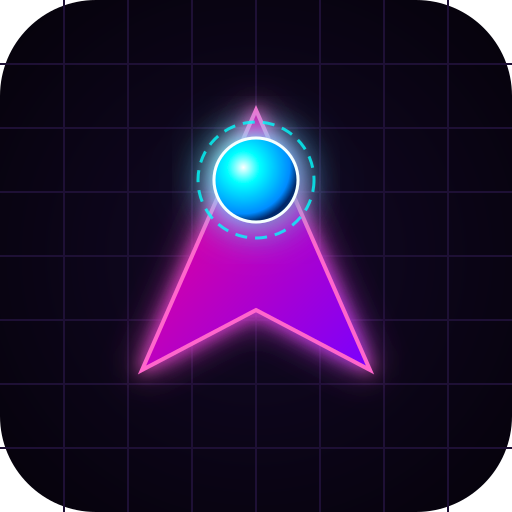

# Neon Collector
================

Neon Collector es un juego de Godot para móvil que te permite recopilar puntos en un tiempo límite de 30 segundos.
Puedes extender el tiempo de juego mediante anuncios o eliminarlos directamente mediante un pago.

**Funcionalidades**

* Recopila puntos en un tiempo límite de 30 segundos
* Extiende el tiempo de juego mediante anuncios
* Elimina anuncios mediante un pago
* Compete con otros jugadores para ver quién puede recopilar más puntos

**Tecnologías utilizadas**

* Godot 3.2 o superior
* GDScript
* AdMob
* GooglePlayBilling

**Cómo jugar**

* Descarga y instala el juego en tu móvil
* Inicia el juego y comienza a recopilar puntos
* Utiliza anuncios o paga para eliminarlos y extender el tiempo de juego

**Monetización**

* Anuncios: recopila puntos y extiende el tiempo de juego mediante anuncios
* Pago: elimina anuncios y obtiene acceso a contenido premium